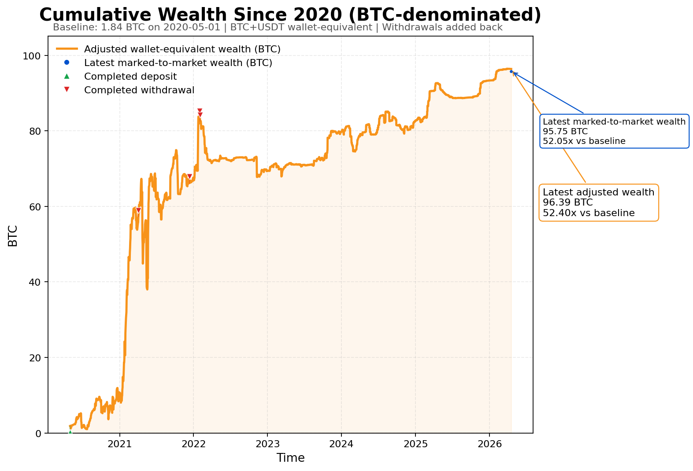

# BTC-Trading-Since-2020

>[English](README.md) | [中文](README.zh-CN.md)

这是一个 open intelligence 实验：在 AI 时代，高质量上下文会成为最稀缺的资产。
这个仓库把一个真实交易账户的长期历史，做成一个可公开检查、可持续扩展的上下文镜像。它覆盖近 6 年、4 万多条订单、17 万多条成交明细。
整个互联网里，可能都没有可比的公共仓库，会以这种细节等级，持续公开一个以 BTC 交易为主的二级交易账户的多年完整历史。

## 为什么要做这件事

大多数公开交易内容，本质上还是叙事，不是账本。

这个仓库反过来：直接公开一个真实交易账户的长期历史镜像，让别人看到真正的成交账本、钱包账本、终态快照和重建锚点，而不是只看截图、只听故事、只读摘要。

Open intelligence，而不是选择性叙事。

## 数据时间范围

- 本次公开数据里的最早事件：**2020-05-01T01:05:55.004Z**
- 本次构建里的最新事件/快照：**2026-04-17T16:18:45.506Z**
- 版本策略：根目录文件名稳定不变，按天用 Git commit/tag 追踪（tag 格式：`data-YYYY-MM-DD`）

## 仓库里包含什么

| File | Source endpoint | Role |
|---|---|---|
| `api-v1-execution-tradeHistory.csv` | `/api/v1/execution/tradeHistory` | primary execution ledger |
| `api-v1-order.csv` | `/api/v1/order` | order intent and lifecycle ledger |
| `api-v1-user-walletHistory.csv` | `/api/v1/user/walletHistory?currency=all` | wallet event ledger across deposits, withdrawals, funding, realised pnl, spot trades, conversions |
| `api-v1-position.snapshot.csv` | `/api/v1/position` | terminal position anchor |
| `api-v1-user-wallet.snapshot-all.csv` | `/api/v1/user/wallet?currency=all` | terminal wallet anchor |
| `api-v1-user-margin.snapshot-all.csv` | `/api/v1/user/margin?currency=all` | terminal margin/equity anchor |
| `api-v1-user-walletSummary.all.csv` | `/api/v1/user/walletSummary?currency=all` | BitMEX-generated summary cross-check |
| `api-v1-instrument.all.csv` | `/api/v1/instrument` | instrument dictionary and contract spec reference |
| `api-v1-wallet-assets.csv` | `/api/v1/wallet/assets` | asset scale and wallet metadata reference |
| `derived-equity-curve.csv` | derived | XBT-equivalent wallet curve across XBT and USDt balances used for the chart |
| `cumulative-performance.png` | derived | README performance figure |
| `manifest.json` | derived | checksums, row counts, time ranges, and build metadata |

## 本次构建的几个关键事实

- `api-v1-order.csv`：**43,214** 行
- `api-v1-execution-tradeHistory.csv`：**173,058** 行
- `api-v1-user-walletHistory.csv`：**17,099** 行
- 时间范围：**2020-05-01 → 2026-04-17**
- 按 executed trade notional 计算，BTC 相关交易约占整份全档案的 **~84.0%**
- 但这个账户在后期明显进一步向 BTC 收敛：若只看 2022 年以来约为 **~93.7%**，2023 年以来约为 **~96.1%**，2024 年以来约为 **~99.0%**
- 曲线基准点：**1.83953943 XBT**，时间 **2020-05-01T14:39:40.387Z**
- XBT 钱包账本里累计完成入金：**1.77199051 XBT**
- XBT 钱包账本里累计完成出金：**66.00180000 XBT**
- 最新调整后钱包等值财富（XBT+USDt 范围）：**96.38685218 XBT**（相对基准 **52.397274x**）
- 最新调整后按保证金计价财富（XBT+USDt 范围）：**95.75314961 XBT**（相对基准 **52.052785x**）

## 参考文档与术语说明

- BitMEX API Explorer 文档页：https://docs.bitmex.com/api-explorer/bitmex-api.html
- BitMEX API Explorer / Swagger JSON：https://www.bitmex.com/api/explorer/swagger.json
- `XBT` 是一些交易所对 Bitcoin（`BTC`）使用的另一种 ticker。若你不熟悉这个叫法，可参考：https://coinmarketcap.com/academy/glossary/xbt

## 账号实时状态看板补充

如果你想看这个账户的实时状态看板补充，可访问：**https://wsnb.online**
这个仓库负责长期历史层；`wsnb.online` 则负责实时状态层。

## 这些文件应该怎么理解

- `tradeHistory`：主要的、会影响余额的成交执行账本。
- `order`：解释下单意图、状态变化和订单生命周期。
- `walletHistory`：钱包侧账本，覆盖入金、出金、资金费、已实现盈亏、现货成交、转换等事件。
- `position` / `wallet` / `margin` 快照：导出时刻的终态锚点，用来帮助重建状态。
- `instrument` 和 `wallet-assets`：参考字典层，用 BitMEX 原生语义解释 symbol、精度、结算货币和合约元数据。
- `walletSummary`：保留为交叉校验层，不作为主历史账本。

## 公版隐私处理规则

- 所有出现过 `account` 的公开文件都删除该列。
- `api-v1-user-walletHistory.csv`：删除 `tx`，删除 `text`，仅在 `transactType` 为 `Withdrawal` 或 `Transfer` 时把 `address` 打成 `Redacted`。
- `api-v1-order.csv`：删除 `text`。
- `api-v1-execution-tradeHistory.csv`：保留 `text`，因为它对解释成交、资金费、结算语义仍有帮助。
- `/api/v1/user` 账户资料和 `/api/v1/execution` 的原始生命周期噪音不公开。

## 派生收益曲线的方法

`derived-equity-curve.csv` 刻意做得简单、可审计：

1. 它跟踪的是 **XBT + USDt 两个钱包合并后的 XBT 等值财富**。
2. 基准点定义为：首个交易日里，最后一次完成入金之后的第一笔完整 XBT 钱包余额。
3. 从这个基准点开始，**完成出金会加回去**，**完成入金会扣掉**，并且会把内部 `Transfer` 行中和掉。
4. `Conversion` 以及 XBT/USDt 的 `SpotTrade` 成对记录按**内部换仓**处理，不视为财富损失。
5. USDt 余额会按公开钱包账本里最近一次观察到的内部 XBT/USDT 转换或现货成交汇率折回 XBT。
6. 所以这条曲线是一个方便公众阅读的 **XBT 等值财富曲线**，**不是** 覆盖所有非 XBT 钱包、所有资产、所有时刻的完整逐时盯市净值。

这样做的好处是：方法足够透明，而且能避免账户在 XBT 和 USDt 之间临时切换时出现假的断崖。

## 明确不放进这个仓库的内容

- 原始 API key / secret
- `/api/v1/user` 个人资料 payload
- 超出 `tradeHistory` 的 `/api/v1/execution` 生命周期噪音
- 登录/IP/设备/账户资料类信息
- `walletHistory` 里的链上 tx hash

## 更新策略

这个仓库的设计目标就是持续刷新。

每次更新应当：

1. 从 BitMEX 拉取最新全量 raw 数据，
2. 用同样的文件名和同样的隐私规则重建 public root，
3. 提交新的根目录版本，
4. 打上 `data-YYYY-MM-DD` 的 tag。

这样一来，读者看到的是稳定文件名；而历史变化则通过 Git 历史和 tag 完整追溯。
